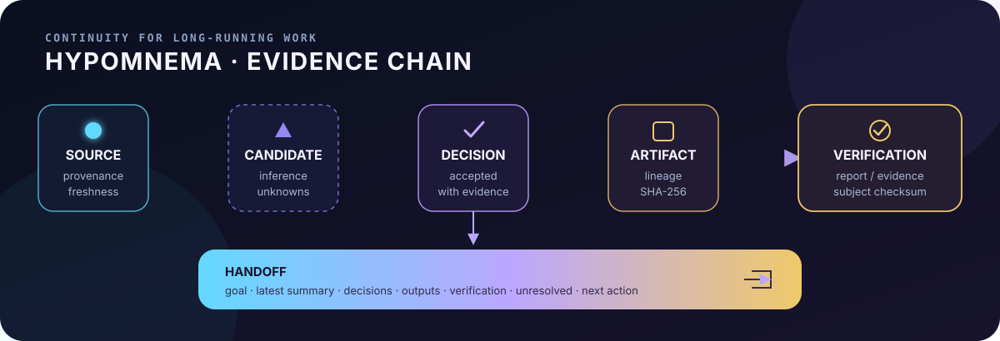

<p align="right"><a href="README.md">🇷🇺 Русский</a> · <strong>🇬🇧 English</strong></p>

# Hypomnema

> Work that outlives the chat.

Hypomnema keeps long-running AI-assisted work outside any single chat. Goals,
sources, decisions, artifacts, verification records, unresolved items, and
next actions remain in the workspace so another person or agent can resume the
work.

It is an AI-native workspace for tasks where lost context, a false “done,” or
an unapproved change is expensive.



## What Hypomnema preserves

- **Resume without chat history.** The agent restores the current goal, latest
  iteration, accepted decisions, unresolved items, freshness warnings, and one
  next action from canonical workspace state.
- **Verification belongs to a specific result version.** Hypomnema records
  exactly which result was checked. When the agent runs a check through
  Hypomnema, process completion and bounded diagnostics are captured
  automatically. A non-zero exit, timeout, or changed subject cannot become a
  successful verification.
- **Bounded independent review.** For important conclusions, evidence collection
  and judgment are separated. A small immutable selection is reviewed separately.
  The calling agent bounds how long it waits. If the review times out or the
  evidence is insufficient, work continues with the missing independent
  confirmation stated explicitly.
- **Handoff without repeated archaeology.** The generated handoff contains the
  goal and summary, decisions, outputs with authority/status, verification
  evidence, freshness warnings, unresolved items, and the next action.

The user states intent and makes decisions; the agent maintains briefs,
manifests, and lifecycle state.

## When it fits

Hypomnema is worth considering when:

- work lasts days or weeks and crosses chats, people, or agents;
- a false completion or unapproved change is expensive;
- decisions, sources, and actual checks must be reconstructed later;
- the result must be handed to another contributor without repeating discovery.

Typical cases include brownfield migrations, production changes with approval
boundaries, and technical investigations with many sources.

## When it probably does not fit

For a one-session feature, prototype, disposable script, or a team where the
issue tracker, ADRs, CI, and review already cover continuity and evidence,
Hypomnema will probably add more process than value.

## Start

Open the directory in your AI agent and describe the task:

```text
Plan a migration of the storage layer from Oracle to PostgreSQL.
Start with inventory, risks, and the first verifiable iteration.
Do not change production yet.
```

The root `AGENTS.md` guides the agent: it registers the task and sources, opens
an iteration, and records the next action. You do not maintain workspace files
by hand.

Hypomnema runs locally and does not require a separate server.

## Documentation

- [Getting started](START_HERE.md) (Russian)
- [Architecture and boundaries](docs/ARCHITECTURE.md)
- [Upgrading](docs/UPGRADING.md)
- [Product claim ledger](docs/POSITIONING.md)
- [Development and verification](CONTRIBUTING.md)

## Updating

Before an update, the agent previews changes to product-managed files. The
installer preserves `workspace.yaml`, manifests, the audit trail, `work/**`,
and custom agents outside product-managed names.

Details: [docs/UPGRADING.md](docs/UPGRADING.md).

## Example

The [Oracle → PostgreSQL migration](examples/oracle-to-postgresql/README.md)
(Russian) shows a complete conversational flow without manual workspace-file
setup.

## License

[Apache License 2.0](LICENSE).

<p align="right"><a href="README.md">🇷🇺 Русский</a> · <strong>🇬🇧 English</strong></p>
