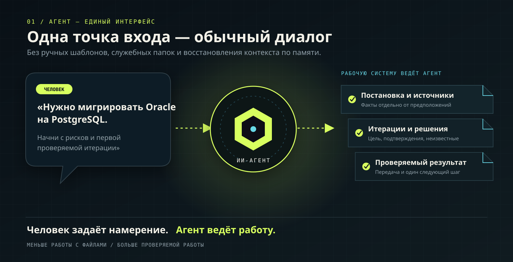
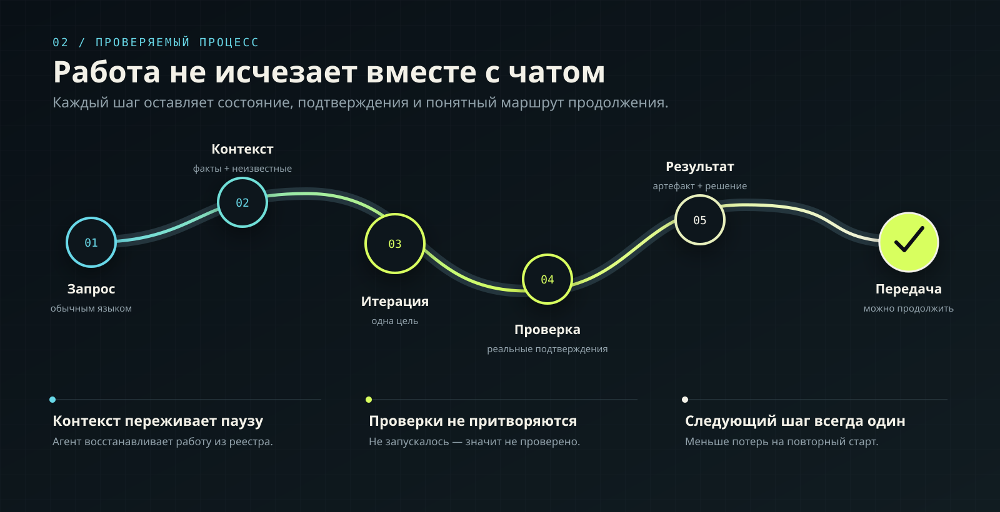
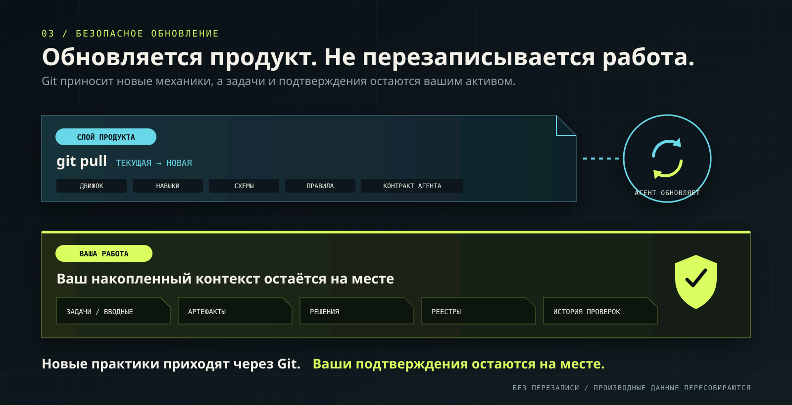

# AI-native Workspace

AI-native Workspace — среда, готовая к хранению и обновлению через Git. В ней
ИИ-агент ведёт инженерную или аналитическую задачу от первого сообщения до
проверяемого результата и передачи следующему исполнителю.
Человек работает только через диалог: не создаёт каталоги, постановки, реестры
и служебные файлы вручную.

Поддерживаются разработка, DevOps, тестирование, анализ, архитектура,
исследования, миграции и техническое лидерство.



## Что получает команда

- **Один понятный интерфейс.** Человек описывает намерение, ограничения и
  решения; агент сам организует рабочее пространство и служебные данные.
- **Контекст, который переживает чат.** Постановка, источники, неизвестные,
  решения и подтверждения сохраняются в удобном для Git виде и
  восстанавливаются после паузы.
- **Проверяемое движение к результату.** Каждая итерация имеет одну цель,
  реальные проверки и один явно зафиксированный следующий шаг.

Один и тот же способ работы подходит разработчику, DevOps-инженеру,
тестировщику, аналитику и техническому лидеру — меняется содержание задачи, а не
механика управления ею.



## Начало за один шаг

После клонирования откройте каталог в ИИ-агенте и опишите задачу:

```text
Нужно мигрировать слой хранения данных с Oracle на PostgreSQL.
Начни с инвентаризации, рисков и первой проверяемой итерации.
Промышленную среду пока не изменяй.
```

Корневой файл `AGENTS.md` направит агента: он сам установит или проверит
управляющий слой, создаст рабочий каталог и постановку, зарегистрирует источники,
откроет итерацию и сохранит следующий шаг.

Подробнее: [START_HERE.md](START_HERE.md).

## Что находится внутри

- `$workspace-task` — единая точка входа для пользователя;
- восемь специализированных навыков для запуска, постановки, восстановления
  контекста, итераций, проверки, завершения, аудита и безопасной миграции;
- два коробочных read-only reader: быстрый `workspace_explorer` и независимый
  `workspace_verifier` с закреплёнными моделями GPT-5.6;
- локальный движок на Node.js 22 без внешней БД и npm-зависимостей;
- версионируемые схемы, правила и реестр миграций;
- канонические реестры, журнал аудита и пересобираемый индекс SQLite;
- установщик с предварительным просмотром и безопасным обновлением.

## Read-only роли и модели

`workspace_explorer` использует `gpt-5.6-terra` с reasoning `medium`;
`workspace_verifier` — `gpt-5.6-sol` с reasoning `high`.

| Модель | Сильная сторона | Ограничение в этом workflow |
|---|---|---|
| `gpt-5.6-terra` | Быстрые read-heavy scans, большие файлы, ниже расход | Меньше глубины на неоднозначной многошаговой проверке |
| `gpt-5.6-sol` | Максимальная глубина, planning, validation и edge cases | Выше задержка и расход токенов |
| `gpt-5.6-luna` | Дешёвые массовые extraction/classification задачи | Слишком сильная экономия качества для brownfield evidence и независимой проверки |

IDs закреплены намеренно: конфигурация роли имеет приоритет над model defaults
родителя. Доступность зависит от account policy, поэтому выбор нужно
перепроверять при каждом product release.

## Git обновляет практики, а не вашу работу



Рабочая среда разделена на два слоя с разными правилами владения.

### Слой продукта

Поступает из основного Git-репозитория:

```text
.codex-plugin/
assets/
agents/
runtime/
skills/
scripts/
templates/
AGENTS.md
README.md
START_HERE.md
examples/
profiles.json
VERSION
```

При следующем запросе агент синхронизирует их установленные копии в
`.ai-workspace/`, `.agents/` и `.codex/agents/`.

### Рабочие данные пользователя

Создаются агентом при работе и не перезаписываются обновлением продукта:

```text
.ai-workspace/workspace.yaml
.ai-workspace/manifests/
.ai-workspace/state/
.ai-workspace/generated/
.ai-workspace/audit/
work/
```

Канонические реестры, журнал аудита и содержательные артефакты можно хранить в
пользовательской ветке или личной копии репозитория. Индекс SQLite и производные
представления пересобираются.

### Как проходит обновление

Пользователь получает новую версию обычным `git pull`. На следующем
содержательном сообщении агент сравнивает `VERSION` с
`.ai-workspace/product.json`, показывает предварительный план и применяет только
изменения файлов продукта.

Установщик не заменяет `workspace.yaml`, реестры, историю аудита, корневой файл
`AGENTS.md`, `work/**` и остальные пользовательские пути. В `.codex/agents/` он
управляет только `workspace_explorer.toml` и `workspace_verifier.toml`; custom
agents под другими именами сохраняются. Каталоги `state` и `generated` можно
безопасно пересобирать из канонического состояния.

## Установка в существующий проект

Агент использует встроенный установщик. Для диагностики или разработки продукта
его можно запустить напрямую:

```powershell
node scripts/install-ai-workspace.mjs `
  --target D:\path\to\workspace `
  --mode brownfield
```

Команда по умолчанию лишь показывает план. Для записи нужен `--write`.
Обновление:

```powershell
node scripts/install-ai-workspace.mjs `
  --target D:\path\to\workspace `
  --update `
  --write
```

## Проверка продукта

```powershell
node --test runtime/engine/workspace.test.mjs scripts/install-ai-workspace.test.mjs scripts/readme-diagrams.test.mjs
node --check runtime/engine/workspace.mjs
node --check scripts/install-ai-workspace.mjs
```

Манифест плагина дополнительно проверяется валидатором `plugin-creator`, а навыки
— валидатором `skill-creator`.

## Пример

Полный разговорный сценарий без ручного создания файлов:
[миграция Oracle → PostgreSQL](examples/oracle-to-postgresql/README.md).

## Лицензия

Проект распространяется по лицензии
[Apache License 2.0](LICENSE). Она разрешает использование, изменение и
распространение продукта с сохранением условий лицензии и уведомлений об
изменённых файлах, а также содержит явный патентный grant.
