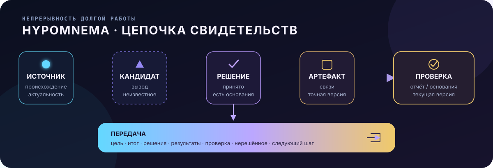

<p align="right"><strong>🇷🇺 Русский</strong> · <a href="README.en.md">🇬🇧 English</a></p>

# Hypomnema

> Работа, которая переживает чат.

Hypomnema хранит ход длительной работы с ИИ-агентом отдельно от истории чата.
В самом проекте остаются цель, источники, решения, результаты, сведения о
проверках, открытые вопросы и следующий шаг. Поэтому работу может продолжить
другой человек или агент.

Hypomnema нужна там, где потерянный контекст, преждевременное «готово» или изменение
без согласования обходятся дорого.



## Что остаётся в проекте

После паузы агент восстанавливает текущую цель, последний этап работы, принятые
решения и открытые вопросы. Он также видит, какие сведения успели устареть, и
с какого шага продолжить.

Каждая проверка относится к конкретной версии результата. Если результат
изменился, прежняя проверка больше не считается актуальной.

Для передачи работы Hypomnema собирает цель, итог, решения, результаты и
сведения о проверках. Туда же входят открытые вопросы и следующий шаг, поэтому
новому исполнителю не приходится заново разбирать всю историю.

Пользователь ставит задачу и принимает решения. Описание задачи, реестры и
текущее состояние работы ведёт агент.

## Когда Hypomnema полезна

Используйте Hypomnema, если:

- работа длится дни или недели и проходит через несколько чатов, людей или
  агентов;
- ошибочное завершение или несогласованное изменение обходится дорого;
- решения, источники и фактические проверки потребуется восстановить позже;
- результат нужно передать другому исполнителю без повторного исследования.

Например, при миграции унаследованной системы, изменении рабочей среды с
обязательным согласованием или техническом обследовании по десяткам источников.

## Когда Hypomnema не нужна

Hypomnema не нужна для небольшой задачи в одном чате, прототипа или разового
скрипта. Она также мало что даст команде, где трекер задач, журнал архитектурных
решений, автоматические проверки и разбор изменений уже сохраняют ход работы и
основания решений. В таких случаях Hypomnema добавит больше процесса, чем
пользы.

## Как начать

Откройте каталог проекта в приложении с ИИ-агентом и опишите задачу обычным
сообщением:

```text
Нужно спланировать миграцию слоя хранения данных с Oracle на PostgreSQL.
Сначала собери сведения, перечисли риски и предложи первый этап с понятной
проверкой. Рабочую систему пока не меняй.
```

Корневой `AGENTS.md` объясняет агенту правила работы. Агент сам регистрирует
задачу и источники, начинает первый этап и записывает следующий шаг. Заполнять
служебные файлы Hypomnema вручную не нужно.

Hypomnema работает локально и не требует отдельного сервера.

## Документация

- [Начало работы](START_HERE.md)
- [Архитектура и границы](docs/ARCHITECTURE.md)
- [Обновление](docs/UPGRADING.md)
- [Что обещает продукт](docs/POSITIONING.md)
- [Разработка и проверки](CONTRIBUTING.md)

## Обновление

Перед обновлением агент показывает, какие файлы самого продукта изменятся.
Установщик не затрагивает `workspace.yaml`, реестры, журнал действий, `work/**`
и пользовательских агентов с другими именами.

Подробности: [docs/UPGRADING.md](docs/UPGRADING.md).

## Пример

[Миграция Oracle → PostgreSQL](examples/oracle-to-postgresql/README.md): пример
работы от постановки задачи до передачи результата. Служебные файлы создаёт
агент.

## Лицензия

[Apache License 2.0](LICENSE).

<p align="right"><strong>🇷🇺 Русский</strong> · <a href="README.en.md">🇬🇧 English</a></p>
